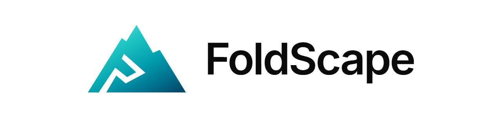
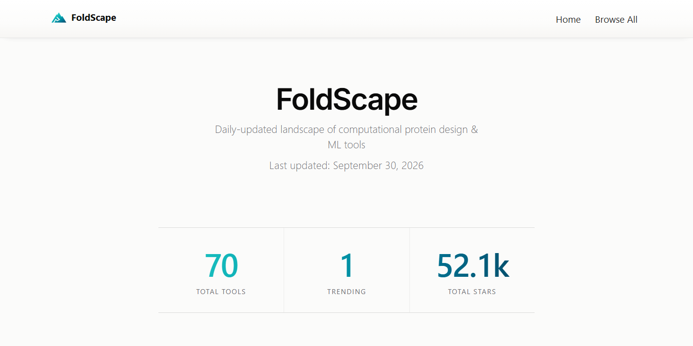

<picture>
  <source media="(prefers-color-scheme: dark)" srcset="assets/readme-banner-dark.png">
  
</picture>

**A curated, daily-updated landscape of computational protein design and machine learning tools.**

  

## What's Tracked

- Structure prediction tools (AlphaFold, ESMFold, etc.)
- Generative protein design (RFDiffusion, Chroma, ProteinMPNN)
- Molecular dynamics & simulation (OpenMM, GROMACS)
- Analysis libraries (Biopython, PyMOL, MDAnalysis)

## Features

- Browse 70 protein ML tools
- Filter by category and language
- Sort by stars or recent activity
- Track trending repositories

## Data

Tool metadata is collected from GitHub and stored in `data/repos.json`. The site auto-deploys on every push.

## License

Code is released under the [MIT License](LICENSE). The FoldScape name and emblem are not covered by this license. All rights reserved.
